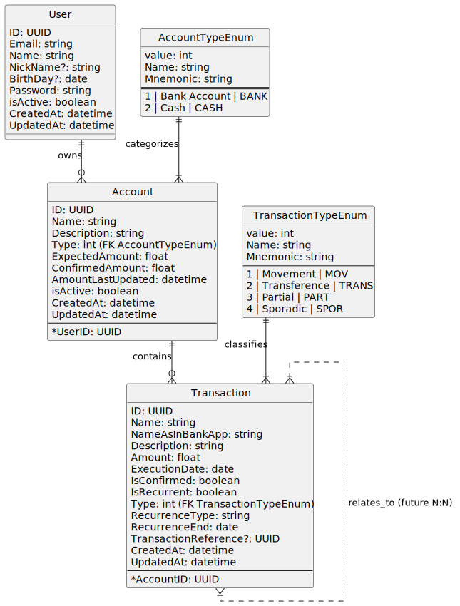

<!--
Copyright 2025 Leonardo Da Vinci Feliciano Sebasitão

Licensed under the Apache License, Version 2.0 (the "License");
you may not use this file except in compliance with the License.
You may obtain a copy of the License at

    http://www.apache.org/licenses/LICENSE-2.0

Unless required by applicable law or agreed to in writing, software
distributed under the License is distributed on an "AS IS" BASIS,
WITHOUT WARRANTIES OR CONDITIONS OF ANY KIND, either express or implied.
See the License for the specific language governing permissions and
limitations under the License.
-->

# MVP Data Model

## Index

- [MVP Data Model](#mvp-data-model)
  - [Index](#index)
  - [Glossary](#glossary)
  - [Entities](#entities)
    - [User](#user)
    - [Account](#account)
    - [Transaction](#transaction)
    - [Every Enum Static Table](#every-enum-static-table)
    - [AccountTypeEnum Values](#accounttypeenum-values)
    - [TransactionTypeEnum Values](#transactiontypeenum-values)
  - [Relationships](#relationships)
  - [Diagram](#diagram)
  - [Future Features](#future-features)

## Glossary

| Term        | Meaning                                                            |
| ----------- | ------------------------------------------------------------------ |
| Transaction | A financial transaction meaning being negative or positive balance |
| User        | The holder of an account                                           |
| Account     | The accumulated of transactions (Income and Expense)               |

## Entities

### User

| Field     | Type     | Obligatory |
| --------- | -------- | ---------- |
| ID        | UUID     | ✅         |
| Email     | string   | ✅         |
| Password  | string   | ✅         |
| Name      | string   | ❌         |
| NickName  | string   | ❌         |
| isActive  | boolean  | ✅         |
| CreatedAt | datetime | ✅         |
| UpdatedAt | datetime | ✅         |
| BirthDay  | Date     | ❌         |

### Account

| Field             | Type        | Obligatory |
| ----------------- | ----------- | ---------- |
| ID                | UUID        | ✅         |
| Name              | string      | ✅         |
| Description       | string      | ✅         |
| Type              | AccountType | ✅         |
| ExpectedAmount    | float       | ✅         |
| ConfirmedAmount   | float       | ✅         |
| AmountLastUpdated | datetime    | ✅         |
| isActive          | boolean     | ✅         |
| UserID            | UUID        | ✅         |
| CreatedAt         | datetime    | ✅         |
| UpdatedAt         | datetime    | ✅         |

### Transaction

| Field                 | Type                | Obligatory |
| --------------------- | ------------------- | ---------- |
| ID                    | UUID                | ✅         |
| Name                  | string              | ✅         |
| NameAsInBankApp       | string              | ✅         |
| Description           | string              | ✅         |
| Amount                | float               | ✅         |
| ExecutionDate         | date                | ✅         |
| IsConfirmed           | boolean             | ✅         |
| IsRecurrent           | boolean             | ✅         |
| Type                  | TransactionTypeEnum | ✅         |
| RecurrenceType        | enum                | ✅         |
| RecurrenceEnd         | date                | ✅         |
| TransactionReference? | UUID                | ❌         |
| AccountID             | UUID                | ✅         |
| CreatedAt             | datetime            | ✅         |
| UpdatedAt             | datetime            | ✅         |

### Every Enum Static Table

| Field    | Type   | Obligatory |
| -------- | ------ | ---------- |
| Name     | string | ✅         |
| Mnemonic | string | ✅         |
| value    | int    | ✅         |

### AccountTypeEnum Values

| Name         | Mnemonic | value |
| ------------ | -------- | ----- |
| Bank Account | BANK     | 1     |
| Cash         | CASH     | 2     |

### TransactionTypeEnum Values

| Name         | Mnemonic | value |
| ------------ | -------- | ----- |
| Movement     | MOV      | 1     |
| Transference | TRANS    | 2     |
| Partial      | PART     | 3     |
| Sporadic     | SPOR     | 4     |

## Relationships

- **User** and **Accounts**
  - A **User** _owns_ many **Accounts**.
  - An **Account** is owned by only one **User**.
- **Account** and **Transactions**.
  - An **Account** _contains_ many **Transactions**.
  - A **Transaction** is contained by only one **Account**.
- A **Transaction** may relate to another **Transaction** (e.g. refund, split). PS.: in the future that might become a N to N relationship.

## Diagram

[PlantUML source](./diagrams/Database.plantuml)

## Future Features

- [ ] 🔐 User Authentication
  - [ ] Login
  - [ ] Logout
  - [ ] Password recovery
- [ ] 🧾 Account Management
  - [ ] Create
  - [ ] List
  - [ ] Edit
  - [ ] Disable accounts
- [ ] 🔄 Transaction Management
  - [ ] Confirm transactions
- [ ] 🔁 Perform Transfers
- [ ] 💰 Income & Expense Management
  - [ ] Differentiation via TransactionTypeEnum
- [ ] 📊 Monthly Budget Forecast
  - [ ] Sum of incomes and expenses per accounting cycle
- [ ] 💡 Free-to-Spend Balance Calculation (Monthly Budget)
